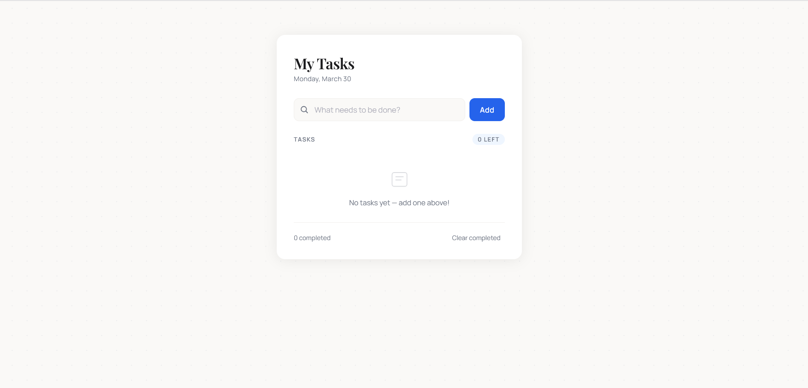
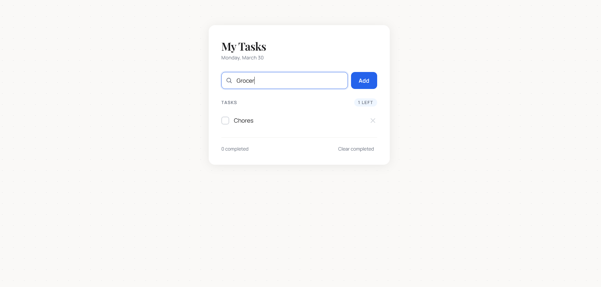
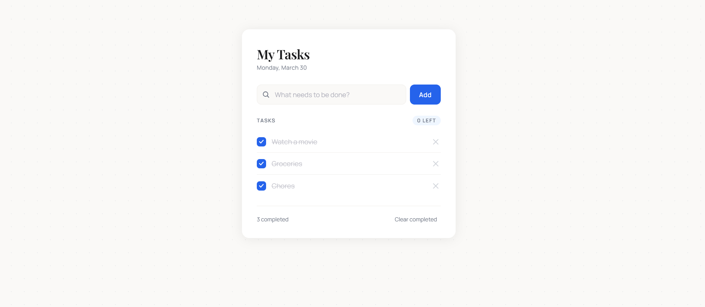

# 📝 To-Do App

A simple and clean To-Do app built with pure HTML, CSS, and JavaScript — no frameworks.

## Features

- Add and delete tasks
- Mark tasks as complete
- Data saved with localStorage (persists on refresh)
- Smooth animations and hover interactions
- Clean UI with separated HTML / CSS / JS files
- Fully responsive on mobile

## Tech Stack

- HTML5
- CSS3 (custom properties, animations)
- JavaScript (DOM manipulation, localStorage)

## Live Demo

[View Live →][(https://imma1114.github.io/to-do-list/)]

## Screenshots

### Dashboard

### Adding a task

### Checked List

## Author

**Immaculate Nhlanhla Modise**  
[LinkedIn](www.linkedin.com/immaculatemodise) · [GitHub](https://imma1114.github.io/to-do-list/)
